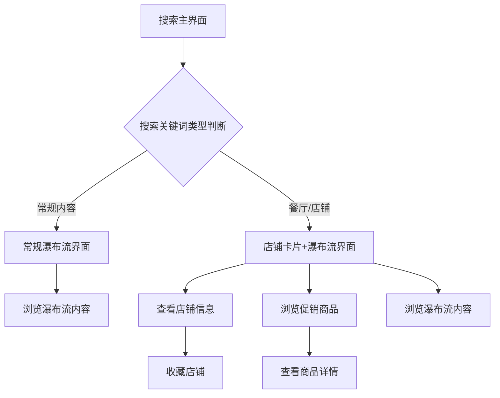

## 1. 产品概述

抖音搜索界面还原项目，基于字节跳动Lynx跨端框架实现抖音搜索核心功能。项目还原抖音搜索的两种核心界面形态：常规瀑布流搜索界面和餐厅/店铺类搜索结果的店铺卡片+瀑布流界面，为抖音前端典型业务模块提供技术验证和实现参考。

当前代码组织采用组件化结构：`ShopHeader`（店铺头部信息）、`ShopProduct`（促销商品横向滚动，含子组件`ShopItem`）、`WaterfallCards`（瀑布流内容）。入口为 `src/index.jsx`，根组件为 `src/App.jsx`，与文档中界面模块一一对应。

## 2. 核心功能

### 2.1 用户角色

| 角色   | 注册方式      | 核心权限               |
| ---- | --------- | ------------------ |
| 普通用户 | 无需注册，直接进入 | 浏览搜索内容、查看店铺信息、收藏店铺 |

### 2.2 功能模块

抖音搜索界面还原包含以下核心页面：

1. **搜索主界面**：包含搜索输入框、瀑布流内容展示区域
2. **店铺卡片界面**：在常规瀑布流上方展示店铺信息卡片和促销商品横向滚动区域

### 2.3 页面详情

| 页面名称   | 模块名称                        | 功能描述                            |
| ------ | --------------------------- | ------------------------------- |
| 搜索主界面  | 搜索输入框                       | 接收用户输入，支持关键词搜索，提供清空和取消功能        |
| 搜索主界面  | 瀑布流容器（WaterfallCards）       | 双列瀑布流布局，当前支持图片内容展示，自适应内容高度      |
| 店铺卡片界面 | 店铺头部信息                      | 展示店铺Logo、名称、评分、评价数、人均消费、距离等核心信息 |
| 店铺卡片界面  | 收藏功能                        | 支持用户收藏/取消收藏店铺，实时更新收藏状态，支持Redux全局状态管理          |
| 店铺卡片界面  | 促销商品区（ShopProduct/ShopItem） | 横向滚动展示店铺促销商品，支持点击查看详情           |
| 店铺卡片界面  | 瀑布流内容                       | 在店铺卡片下方继续展示搜索结果瀑布流              |
| 全局状态管理  | Redux状态管理                   | 集成Redux Toolkit，统一管理搜索、收藏、内容展示等全局状态，支持异步数据流和DevTools调试 |

## 3. 核心流程

### 常规搜索流程

用户进入搜索界面 → 输入搜索关键词 → 系统判断是否为餐厅/店铺类内容 → 展示对应界面形态（当为餐厅/店铺时在瀑布流顶部插入`ShopHeader`与`ShopProduct`组成的店铺卡片区域） → 用户浏览内容 → 进行交互操作（收藏、查看详情等）

### 店铺搜索流程

用户搜索餐厅/店铺关键词 → 系统识别为店铺类搜索 → 在瀑布流顶部插入店铺卡片 → 展示店铺基本信息和促销商品 → 用户可收藏店铺或查看商品详情 → 继续浏览下方瀑布流内容

## 4. 用户界面设计

### 4.1 设计风格

* **主色调**：抖音品牌色，黑色背景配合白色卡片

* **按钮样式**：扁平化设计，圆角按钮，触摸反馈明显

* **字体规范**：系统默认字体，标题16px，正文14px，辅助文字12px

* **布局风格**：卡片式布局，瀑布流采用双列网格，间距统一为20rpx

* **图标风格**：线性图标，简洁明了，符合抖音原生设计风格

### 4.2 页面设计概述

| 页面名称   | 模块名称                        | UI元素                                                          |
| ------ | --------------------------- | ------------------------------------------------------------- |
| 搜索主界面  | 瀑布流区域（WaterfallCards）       | 双列网格布局，每张卡片显示图片内容，高度自适应，圆角卡片设计，支持触摸反馈                         |
| 店铺卡片界面 | 店铺头部卡片                      | 左侧店铺Logo（60x60px）带直播中标识，右侧三行信息布局：店铺名称+标签、评分+评价数+人均消费、分类+地址+距离 |
| 店铺卡片界面 | 收藏按钮                        | 心形图标，红色表示已收藏，白色表示未收藏，点击有动画反馈                                  |
| 店铺卡片界面 | 促销商品区（ShopProduct/ShopItem） | 横向滚动列表，每个商品项为方形缩略图，支持左右滑动浏览                                   |

### 4.3 响应式设计

* **桌面端优先**：基于Lynx跨端框架，默认适配桌面端显示

* **移动端适配**：支持移动端触摸交互，瀑布流自动适配单列/双列布局

* **跨端兼容**：利用Lynx框架原生渲染能力，确保iOS/Android体验一致性

## 5. 已完成与未完成功能说明

### 5.1 已完成功能 ✓

* **瀑布流基础布局**：双列瀑布流组件（`WaterfallCards`），支持图片内容展示；在 `App.jsx` 中通过 Lynx `<list list-type="waterfall" span-count={2}>` 渲染

* **店铺头部信息卡片**：完整的店铺信息展示（`ShopHeader`），包括Logo、名称、评分等

* **收藏功能**：支持店铺收藏/取消收藏，状态管理完整

* **促销商品横向滚动**：基础横向滚动列表实现（`ShopProduct`，子项`ShopItem`），静态资源来源于 `src/assets/PromotionProduct/*.png`

* **界面基础样式**：符合抖音原生设计风格的UI实现

### 5.2 未完成功能 ✗

* **搜索输入框组件**：需要实现搜索输入、关键词判断逻辑

* **内容类型识别**：需要实现餐厅/店铺关键词的自动识别机制

* **动态数据加载**：当前使用静态数据，需要接入真实搜索API

* **瀑布流滚动加载**：需要实现触底加载更多功能

* **视频内容支持**：当前仅支持图片，需要增加视频内容展示

* **交互手势优化**：需要完善触摸反馈和手势操作

### 5.3 后续开发对接点

1. **搜索功能接入点**：在 `App.jsx` 中预留搜索状态管理位置
2. **数据接口对接点**：瀑布流组件（`WaterfallCards`）和店铺卡片组件（`ShopHeader`/`ShopProduct`）已预留数据 props 接口
3. **交互逻辑扩展点**：收藏功能和卡片点击事件已预留回调函数
4. **样式主题对接点**：CSS变量和样式类名已规范化，支持主题切换
5. **Redux状态管理接入**：已集成Redux Toolkit，支持全局状态管理和异步数据流

## 6. 非功能需求

### 6.1 性能要求

* **首次渲染耗时**：≤ 500ms（静态资源首屏），确保用户快速看到内容

* **瀑布流加载延迟**：≤ 200ms，滑动过程中无明显卡顿

* **图片加载优化**：支持懒加载，首屏图片优先加载

### 6.2 兼容性要求

* **Lynx框架版本**：兼容 `@lynx-js/react@^0.114.5`

* **跨端适配**：支持iOS 11+、Android 5.0+系统版本

* **屏幕适配**：支持375px-768px屏幕宽度范围

* **网络环境**：支持WiFi、4G、5G网络环境下的正常使用

### 6.3 代码-文档衔接补充

* **入口与根组件**：`lynx.config.js` 指定入口为 `./src/index.jsx`，根组件为 `src/App.jsx`

* **组件与文件结构**：

  * `src/components/ShopHeader/index.jsx|index.css`

  * `src/components/ShopProduct/index.jsx|index.css`，子组件 `src/components/ShopProduct/ShopItem/index.jsx|index.css`

  * `src/components/WaterfallCards/index.jsx|index.css`

* **静态资源组织**：图标位于 `src/assets/Icons`，促销图片位于 `src/assets/PromotionProduct`，瀑布流示例图片与聚合脚本位于 `src/assets/example-pictures/comment-cards`

* **测试现状提示**：`src/__tests__/index.test.jsx` 的快照与现有路径不一致（引用了不存在资源与 `App.tsx`），后续需更新测试用例与快照以对齐当前结构。

