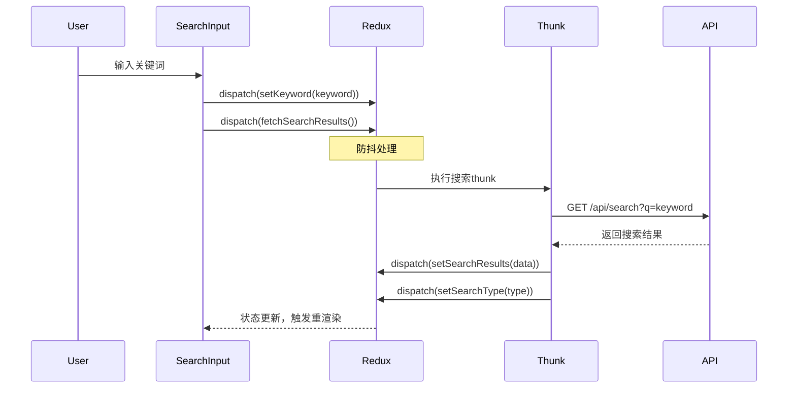
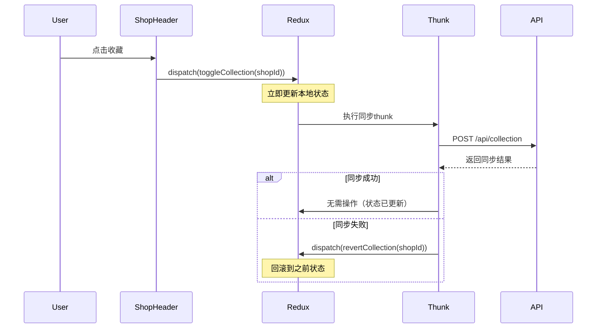

# 抖音搜索项目 Redux 数据管理方案

## 1. 架构概述

本项目采用 Redux Toolkit (RTK) 作为全局状态管理解决方案，结合 React-Redux 提供类型安全、可预测的状态管理。通过集中化的状态管理，实现搜索、收藏、内容展示等核心功能的跨组件状态共享。

### 1.1 核心优势
- **可预测的状态更新**：单一数据源，状态变化可追踪
- **类型安全**：完整的 TypeScript 支持
- **异步流程管理**：内置 thunk 支持，简化异步操作
- **开发体验**：Redux DevTools 调试支持
- **代码简洁**：RTK 减少样板代码，提高开发效率

## 2. 状态结构设计

### 2.1 根状态接口
```typescript
// src/store/types.ts
export interface RootState {
  search: SearchState;
  collection: CollectionState;
  content: ContentState;
  ui: UIState;
}
```

### 2.2 搜索状态 (SearchState)
```typescript
export interface SearchState {
  keyword: string;           // 当前搜索关键词
  type: 'normal' | 'shop' | 'restaurant'; // 搜索类型
  isLoading: boolean;        // 搜索加载状态
  error: string | null;      // 错误信息
  history: string[];         // 搜索历史
  suggestions: string[];   // 搜索建议
}
```

### 2.3 收藏状态 (CollectionState)
```typescript
export interface CollectionState {
  shops: string[];           // 收藏的店铺ID数组
  isSyncing: boolean;        // 同步状态
  lastSyncTime: number;      // 最后同步时间
}
```

### 2.4 内容状态 (ContentState)
```typescript
export interface ContentState {
  waterfallItems: WaterfallItem[];    // 瀑布流项目
  shopData: ShopData | null;            // 店铺数据
  promotionProducts: Product[];         // 促销商品
  hasMore: boolean;                     // 是否还有更多
  page: number;                        // 当前页码
  total: number;                       // 总数
}
```

### 2.5 UI状态 (UIState)
```typescript
export interface UIState {
  scrollPosition: number;    // 滚动位置
  selectedTab: string;       // 选中的标签
  showLoginModal: boolean;   // 显示登录弹窗
  isRefreshing: boolean;     // 下拉刷新状态
}
```

## 3. Slice 设计

### 3.1 搜索 Slice (searchSlice)
```typescript
// src/store/slices/searchSlice.ts
import { createSlice, PayloadAction, createAsyncThunk } from '@reduxjs/toolkit';

export const fetchSearchSuggestions = createAsyncThunk(
  'search/fetchSuggestions',
  async (keyword: string) => {
    const response = await api.getSearchSuggestions(keyword);
    return response.data;
  }
);

const searchSlice = createSlice({
  name: 'search',
  initialState: {
    keyword: '',
    type: 'normal',
    isLoading: false,
    error: null,
    history: [],
    suggestions: []
  },
  reducers: {
    setKeyword: (state, action: PayloadAction<string>) => {
      state.keyword = action.payload;
    },
    setSearchType: (state, action: PayloadAction<'normal' | 'shop' | 'restaurant'>) => {
      state.type = action.payload;
    },
    clearSearch: (state) => {
      state.keyword = '';
      state.suggestions = [];
    },
    addToHistory: (state, action: PayloadAction<string>) => {
      state.history = [action.payload, ...state.history.filter(item => item !== action.payload)].slice(0, 10);
    }
  },
  extraReducers: (builder) => {
    builder
      .addCase(fetchSearchSuggestions.pending, (state) => {
        state.isLoading = true;
      })
      .addCase(fetchSearchSuggestions.fulfilled, (state, action) => {
        state.isLoading = false;
        state.suggestions = action.payload;
      })
      .addCase(fetchSearchSuggestions.rejected, (state, action) => {
        state.isLoading = false;
        state.error = action.error.message || '获取搜索建议失败';
      });
  }
});
```

### 3.2 收藏 Slice (collectionSlice)
```typescript
// src/store/slices/collectionSlice.ts
import { createSlice, PayloadAction, createAsyncThunk } from '@reduxjs/toolkit';

export const syncCollection = createAsyncThunk(
  'collection/sync',
  async (shopId: string, { getState }) => {
    const state = getState() as RootState;
    const isCollecting = state.collection.shops.includes(shopId);
    const response = await api.updateCollection(shopId, !isCollecting);
    return { shopId, action: !isCollecting };
  }
);

const collectionSlice = createSlice({
  name: 'collection',
  initialState: {
    shops: [],
    isSyncing: false,
    lastSyncTime: 0
  },
  reducers: {
    toggleCollection: (state, action: PayloadAction<string>) => {
      const shopId = action.payload;
      const index = state.shops.indexOf(shopId);
      if (index > -1) {
        state.shops.splice(index, 1);
      } else {
        state.shops.push(shopId);
      }
    },
    setCollections: (state, action: PayloadAction<string[]>) => {
      state.shops = action.payload;
    }
  },
  extraReducers: (builder) => {
    builder
      .addCase(syncCollection.pending, (state) => {
        state.isSyncing = true;
      })
      .addCase(syncCollection.fulfilled, (state, action) => {
        state.isSyncing = false;
        state.lastSyncTime = Date.now();
        const { shopId, action: isCollecting } = action.payload;
        if (isCollecting) {
          state.shops.push(shopId);
        } else {
          state.shops = state.shops.filter(id => id !== shopId);
        }
      })
      .addCase(syncCollection.rejected, (state) => {
        state.isSyncing = false;
      });
  }
});
```

### 3.3 内容 Slice (contentSlice)
```typescript
// src/store/slices/contentSlice.ts
import { createSlice, PayloadAction, createAsyncThunk } from '@reduxjs/toolkit';

export const fetchWaterfallItems = createAsyncThunk(
  'content/fetchWaterfallItems',
  async ({ page, type }: { page: number; type: string }) => {
    const response = await api.getWaterfallItems(page, type);
    return response.data;
  }
);

export const fetchShopData = createAsyncThunk(
  'content/fetchShopData',
  async (shopId: string) => {
    const response = await api.getShopData(shopId);
    return response.data;
  }
);

const contentSlice = createSlice({
  name: 'content',
  initialState: {
    waterfallItems: [],
    shopData: null,
    promotionProducts: [],
    hasMore: true,
    page: 1,
    total: 0
  },
  reducers: {
    addWaterfallItems: (state, action: PayloadAction<WaterfallItem[]>) => {
      state.waterfallItems.push(...action.payload);
    },
    clearContent: (state) => {
      state.waterfallItems = [];
      state.shopData = null;
      state.promotionProducts = [];
      state.page = 1;
      state.hasMore = true;
    },
    setPage: (state, action: PayloadAction<number>) => {
      state.page = action.payload;
    }
  },
  extraReducers: (builder) => {
    builder
      .addCase(fetchWaterfallItems.fulfilled, (state, action) => {
        const { items, hasMore, total } = action.payload;
        state.waterfallItems.push(...items);
        state.hasMore = hasMore;
        state.total = total;
      })
      .addCase(fetchShopData.fulfilled, (state, action) => {
        state.shopData = action.payload.shop;
        state.promotionProducts = action.payload.products;
      });
  }
});
```

## 4. Store 配置

### 4.1 主 Store 配置
```typescript
// src/store/index.ts
import { configureStore } from '@reduxjs/toolkit';
import searchReducer from './slices/searchSlice';
import collectionReducer from './slices/collectionSlice';
import contentReducer from './slices/contentSlice';
import uiReducer from './slices/uiSlice';

export const store = configureStore({
  reducer: {
    search: searchReducer,
    collection: collectionReducer,
    content: contentReducer,
    ui: uiReducer
  },
  middleware: (getDefaultMiddleware) =>
    getDefaultMiddleware({
      serializableCheck: {
        ignoredActions: ['persist/PERSIST', 'persist/REHYDRATE']
      }
    }),
  devTools: process.env.NODE_ENV !== 'production'
});

export type RootState = ReturnType<typeof store.getState>;
export type AppDispatch = typeof store.dispatch;
```

### 4.2 自定义 Hooks
```typescript
// src/store/hooks.ts
import { TypedUseSelectorHook, useDispatch, useSelector } from 'react-redux';
import type { RootState, AppDispatch } from './index';

export const useAppDispatch = () => useDispatch<AppDispatch>();
export const useAppSelector: TypedUseSelectorHook<RootState> = useSelector;
```

## 5. 组件集成方案

### 5.1 Provider 集成
```typescript
// src/index.jsx
import { Provider } from 'react-redux';
import { store } from './store';

export function App() {
  return (
    <Provider store={store}>
      <SearchApp />
    </Provider>
  );
}
```

### 5.2 组件状态使用
```typescript
// src/components/ShopHeader/index.jsx
import { useAppSelector, useAppDispatch } from '../../store/hooks';
import { syncCollection } from '../../store/slices/collectionSlice';

export function ShopHeader({ shopId }) {
  const dispatch = useAppDispatch();
  const isCollected = useAppSelector(state => 
    state.collection.shops.includes(shopId)
  );
  const isSyncing = useAppSelector(state => state.collection.isSyncing);
  
  const handleCollect = async () => {
    await dispatch(syncCollection(shopId));
  };
  
  return (
    <view className="collect-button" onClick={handleCollect}>
      {isSyncing ? '同步中...' : isCollected ? '已收藏' : '收藏'}
    </view>
  );
}
```

### 5.3 瀑布流组件集成
```typescript
// src/components/WaterfallCards/index.jsx
import { useAppSelector, useAppDispatch } from '../../store/hooks';
import { fetchWaterfallItems } from '../../store/slices/contentSlice';

export function WaterfallCards() {
  const dispatch = useAppDispatch();
  const items = useAppSelector(state => state.content.waterfallItems);
  const hasMore = useAppSelector(state => state.content.hasMore);
  const page = useAppSelector(state => state.content.page);
  const searchType = useAppSelector(state => state.search.type);
  
  const loadMore = async () => {
    if (hasMore) {
      await dispatch(fetchWaterfallItems({ page: page + 1, type: searchType }));
    }
  };
  
  return (
    // ... 瀑布流渲染逻辑
  );
}
```

## 6. 异步数据流管理

### 6.1 搜索流程


### 6.2 收藏同步流程


## 7. 性能优化策略

### 7.1 状态选择器优化
```typescript
// 使用 reselect 创建记忆化选择器
import { createSelector } from '@reduxjs/toolkit';

const selectCollection = (state: RootState) => state.collection.shops;

export const selectIsCollected = createSelector(
  [selectCollection, (state, shopId: string) => shopId],
  (shops, shopId) => shops.includes(shopId)
);

// 在组件中使用
const isCollected = useAppSelector(state => selectIsCollected(state, shopId));
```

### 7.2 异步请求优化
```typescript
// 防抖搜索
let searchTimeout: NodeJS.Timeout;

export const debouncedSearch = (keyword: string) => {
  return (dispatch: AppDispatch) => {
    clearTimeout(searchTimeout);
    searchTimeout = setTimeout(() => {
      dispatch(fetchSearchResults(keyword));
    }, 300);
  };
};
```

### 7.3 数据缓存策略
```typescript
// 搜索结果缓存
interface SearchCache {
  [keyword: string]: {
    data: SearchResult;
    timestamp: number;
    expires: number;
  };
}

// 在slice中实现缓存逻辑
const searchCache: SearchCache = {};

export const fetchSearchResults = createAsyncThunk(
  'search/fetchResults',
  async (keyword: string) => {
    // 检查缓存
    const cached = searchCache[keyword];
    if (cached && Date.now() - cached.timestamp < cached.expires) {
      return cached.data;
    }
    
    const response = await api.search(keyword);
    
    // 更新缓存
    searchCache[keyword] = {
      data: response.data,
      timestamp: Date.now(),
      expires: 5 * 60 * 1000 // 5分钟
    };
    
    return response.data;
  }
);
```

## 8. 错误处理机制

### 8.1 全局错误处理
```typescript
// src/store/middleware/errorMiddleware.ts
export const errorMiddleware = (store: any) => (next: any) => (action: any) => {
  if (action.type.endsWith('/rejected')) {
    const errorMessage = action.error?.message || '操作失败';
    
    // 显示错误提示
    if (typeof lynx !== 'undefined' && lynx.showToast) {
      lynx.showToast({
        title: errorMessage,
        icon: 'none',
        duration: 2000
      });
    }
    
    // 记录错误日志
    console.error(`Redux Action Error: ${action.type}`, action.error);
  }
  
  return next(action);
};
```

### 8.2 网络重试机制
```typescript
export const fetchWithRetry = createAsyncThunk(
  'content/fetchWithRetry',
  async ({ url, retries = 3 }: { url: string; retries?: number }) => {
    let lastError;
    
    for (let i = 0; i < retries; i++) {
      try {
        const response = await api.get(url);
        return response.data;
      } catch (error) {
        lastError = error;
        if (i < retries - 1) {
          await new Promise(resolve => setTimeout(resolve, 1000 * (i + 1)));
        }
      }
    }
    
    throw lastError;
  }
);
```

## 9. 开发调试工具

### 9.1 Redux DevTools 配置
```typescript
// 在开发环境中启用Redux DevTools
export const store = configureStore({
  reducer: rootReducer,
  devTools: process.env.NODE_ENV !== 'production',
  middleware: (getDefaultMiddleware) =>
    getDefaultMiddleware({
      serializableCheck: false,
      immutableCheck: false
    })
});
```

### 9.2 状态快照功能
```typescript
// 状态导出/导入功能
export const exportState = () => {
  const state = store.getState();
  return JSON.stringify(state, null, 2);
};

export const importState = (stateJson: string) => {
  try {
    const state = JSON.parse(stateJson);
    // 验证状态结构
    if (isValidState(state)) {
      // 重新加载应用状态
      window.location.reload();
    }
  } catch (error) {
    console.error('Invalid state format:', error);
  }
};
```

## 10. 迁移计划

### 10.1 渐进式迁移策略
1. **第一步**：创建基础 Redux store 和 slice
2. **第二步**：将收藏功能从 useState 迁移到 Redux
3. **第三步**：实现搜索状态管理
4. **第四步**：集成瀑布流数据管理
5. **第五步**：添加异步数据加载和缓存

### 10.2 兼容性保证
- 保持现有组件接口不变
- 逐步替换内部状态管理
- 提供回滚机制
- 确保测试覆盖

### 10.3 代码组织
```
src/
├── store/
│   ├── index.ts          # Store配置
│   ├── hooks.ts          # 自定义Hooks
│   ├── types.ts          # TypeScript类型定义
│   ├── slices/
│   │   ├── searchSlice.ts
│   │   ├── collectionSlice.ts
│   │   ├── contentSlice.ts
│   │   └── uiSlice.ts
│   ├── middleware/
│   │   ├── errorMiddleware.ts
│   │   └── loggerMiddleware.ts
│   └── utils/
│       ├── cache.ts
│       └── selectors.ts
```

通过以上方案，项目将获得强大的状态管理能力，支持复杂的异步数据流，同时保持代码的可维护性和可扩展性。