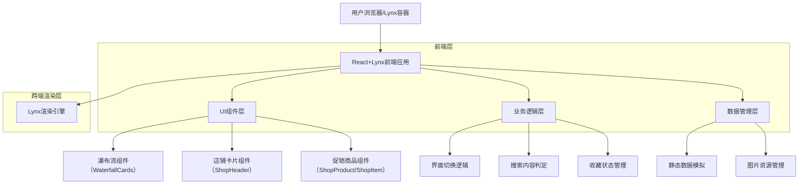
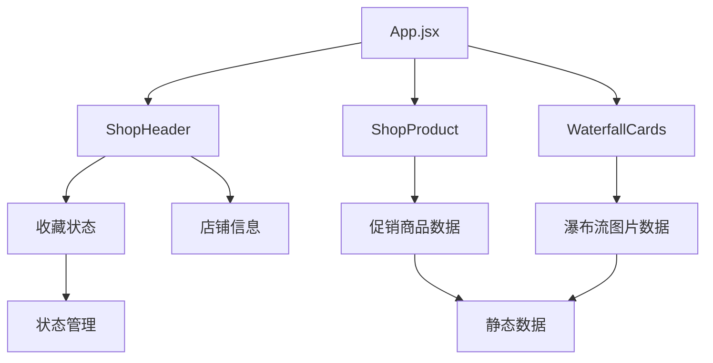

## 1. 架构设计



## 2. 技术描述

### 核心技术栈
- **前端框架**: `@lynx-js/react@^0.114.5`（提供 React 语法与 Hooks 绑定）
- **构建工具**: `@lynx-js/rspeedy@^0.12.0`（Lynx 官方构建工具）
- **React 支持插件**: `@lynx-js/react-rsbuild-plugin@^0.11.4`
- **二维码预览插件**: `@lynx-js/qrcode-rsbuild-plugin@^0.4.3`
- **测试框架**: `vitest@^3.2.4`
- **样式方案**: CSS（rpx 单位，跨端适配）
- **后端服务**: 无（当前为纯前端静态实现）

### 核心依赖库
- **@lynx-js/react**: Lynx 跨端框架 React 绑定
- **@lynx-js/rspeedy**: Lynx 应用构建和开发工具
- **@lynx-js/react-rsbuild-plugin**: React 支持插件
- **@lynx-js/qrcode-rsbuild-plugin**: 开发环境二维码预览插件

## 3. 应用入口与路由

- **入口文件**: `lynx.config.js` 指定 `source.entry: './src/index.jsx'`
- **根组件**: `src/App.jsx`
- **路由状态**: 当前为单页应用，无显式路由配置；可在后续按需引入路由并扩展 `/search`、`/shop/:id` 等路径。

## 4. 组件架构

### 4.1 核心组件结构
```
src/
├── components/
│   ├── ShopHeader/          # 店铺头部信息组件
│   │   ├── index.jsx       # 店铺Logo、名称、评分等展示
│   │   └── index.css       # 店铺头部样式
│   ├── ShopProduct/         # 促销商品组件
│   │   ├── index.jsx       # 横向滚动商品列表
│   │   ├── index.css       # 商品列表样式
│   │   └── ShopItem/       # 单个商品项组件
│   └── WaterfallCards/      # 瀑布流卡片组件
│       ├── index.jsx       # 双列瀑布流实现
│       └── index.css       # 瀑布流样式
├── App.jsx                 # 主应用组件
└── index.jsx              # 应用入口文件
```

### 4.2 组件数据流


## 5. 已完成代码解析

### 5.1 项目结构说明
- **src/**: 源代码目录
  - **components/**: 可复用组件目录
  - **assets/**: 静态资源目录（图片、图标等）
  - **App.jsx**: 根组件，负责整体布局结构
  - **index.jsx**: 应用入口文件

### 5.2 关键文件作用
- **App.jsx**: 使用 Lynx 的 `<list>` 组件实现瀑布流布局，集成店铺头部和商品组件；`<list-item full-span={true}>` 用于在瀑布流顶部全宽展示店铺卡片区域
- **ShopHeader/index.jsx**: 实现店铺信息展示，包含收藏功能状态管理
- **WaterfallCards/index.jsx**: 实现双列瀑布流（`list-type="waterfall"`、`span-count={2}`），支持自适应高度的图片展示
- **ShopProduct/index.jsx**: 实现横向滚动的促销商品列表

### 5.3 已实现核心逻辑
- **瀑布流基础渲染**: 使用Lynx原生`<list>`组件，配置`list-type="waterfall"`和`span-count={2}`
- **店铺信息展示**: 完整的店铺头部信息布局和样式实现
- **收藏状态管理**: 使用React useState实现收藏功能的交互逻辑
- **响应式布局**: 基于rpx单位的跨端适配方案

## 6. 关键技术方案

### 6.1 瀑布流布局实现
```jsx
// 使用Lynx原生瀑布流组件
<list
  className="App WaterfallList"
  list-type="waterfall"
  span-count={2}
  scroll-orientation="vertical"
  column-gap="20rpx"
  main-axis-gap="20rpx"
>
  <!-- 店铺卡片全宽展示 -->
  <list-item full-span={true} item-key="header">
    <!-- 店铺头部和商品组件 -->
  </list-item>
  <!-- 瀑布流内容 -->
  <WaterfallCards />
</list>
```

### 6.2 店铺卡片条件渲染框架
```jsx
// 预留的搜索类型判断逻辑
const searchType = detectSearchType(searchKeyword);
const showShopCard = searchType === 'restaurant' || searchType === 'shop';

// 条件渲染店铺卡片
{showShopCard && (
  <list-item full-span={true}>
    <ShopHeader />
    <ShopProduct />
  </list-item>
)}
```

### 6.3 跨端适配方案
- **屏幕适配**: 使用 rpx 单位，基于 750px 设计稿自动适配
- **组件适配**: 使用 Lynx 原生组件确保跨端一致性
- **样式适配**: CSS 采用 flex 布局，支持不同屏幕尺寸

## 7. 扩展与风险

### 7.1 后续开发扩展点
1. **搜索功能完整实现**: 需要接入搜索API，实现关键词联想和搜索结果
2. **动态数据加载**: 从静态数据切换到真实API数据，实现分页加载
3. **视频内容支持**: 扩展瀑布流支持视频内容展示和播放
4. **用户系统接入**: 实现用户登录、收藏同步等个性化功能
5. **性能优化**: 实现图片懒加载、虚拟滚动等性能优化方案

### 7.2 潜在技术风险

#### 瀑布流性能风险
- **问题**: 大量图片加载可能导致内存占用过高
- **应对**: 实现虚拟滚动，只渲染可视区域内容
- **优化**: 图片懒加载，使用WebP格式，压缩图片大小

#### 跨端兼容性风险
- **问题**: Lynx框架版本更新可能导致API变更
- **应对**: 锁定核心依赖版本，定期升级测试
- **方案**: 封装跨端API调用层，降低框架依赖

#### 数据加载延迟风险
- **问题**: 网络不稳定时瀑布流加载体验差
- **应对**: 实现骨架屏和加载状态提示
- **优化**: 预加载策略，缓存机制实现

### 7.3 技术债务管理
- **代码规范**: 建立完善的 ESLint、Prettier 配置
- **测试覆盖**: 增加单元测试和集成测试
- **文档维护**: 保持技术文档与代码同步更新（注意现有 `src/__tests__/index.test.jsx` 与路径、资源不一致需更新）
- **性能监控**: 接入性能监控工具，持续优化用户体验

## 8. 代码-文档对齐补充
- **入口与构建**: `lynx.config.js` 使用 `@lynx-js/rspeedy`，入口为 `./src/index.jsx`
- **类型声明**: 存在 `src/rspeedy-env.d.ts`，用于图片与环境类型声明
- **路径规范**: 统一相对路径导入，显式 `.jsx/.css` 扩展名；暂未使用路径别名
