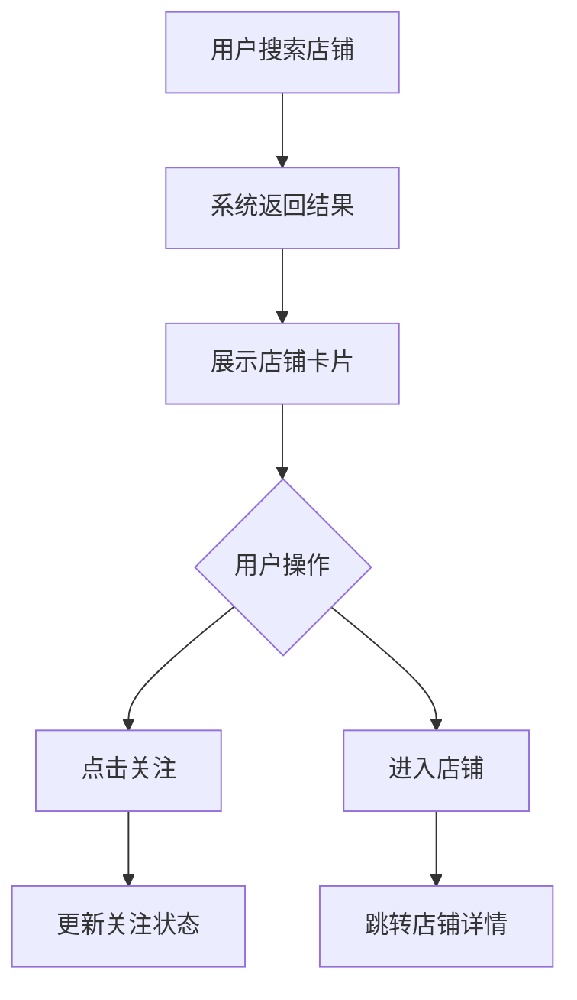

## 1. 产品概述
抖音搜索店铺卡片组件，用于在搜索结果中展示店铺信息。当用户搜索店铺名称时，展示包含店铺基本信息、评分、销量等关键数据的卡片式组件。

该组件将作为Lynx跨端框架的核心展示组件，在抖音搜索场景中提供标准化的店铺信息展示能力。

## 2. 核心功能

### 2.1 功能模块
店铺卡片组件包含以下核心模块：

1. **店铺头部信息**: 店铺名称、认证标识、评分展示
2. **店铺数据指标**: 粉丝数、作品数、获赞数
3. **店铺商品展示**: 热门商品图片轮播
4. **店铺标签**: 店铺类型、特色标签
5. **操作按钮**: 关注按钮、进入店铺按钮

### 2.2 页面详情
| 页面名称 | 模块名称 | 功能描述 |
|---------|---------|---------|
| 店铺卡片 | 店铺头像 | 显示店铺头像，支持圆角展示 |
| 店铺卡片 | 店铺名称 | 显示店铺完整名称，过长时省略 |
| 店铺卡片 | 认证标识 | 显示官方认证图标 |
| 店铺卡片 | 评分展示 | 显示店铺综合评分，包含星级 |
| 店铺卡片 | 数据指标 | 展示粉丝数、作品数、获赞数，数字格式化 |
| 店铺卡片 | 商品展示 | 横向滚动展示热门商品图片 |
| 店铺卡片 | 店铺标签 | 显示店铺类型和特色标签 |
| 店铺卡片 | 关注按钮 | 可点击的关注/已关注状态切换 |
| 店铺卡片 | 进入店铺 | 点击进入店铺详情页 |

## 3. 核心流程
用户搜索店铺名称 → 系统返回搜索结果 → 展示店铺卡片组件 → 用户可点击关注或进入店铺

## 4. 用户界面设计

### 4.1 设计规范
- **主色调**: 抖音品牌色 #FF0050
- **辅助色**: 灰色系 #666666、#999999
- **背景色**: 白色 #FFFFFF
- **按钮样式**: 圆角矩形，关注按钮使用品牌色
- **字体规范**: 
  - 店铺名称：16px 粗体
  - 数据指标：14px 常规
  - 按钮文字：14px 中等
- **图标风格**: 线性图标，简洁现代

### 4.2 组件布局
| 模块名称 | UI元素 | 设计说明 |
|---------|--------|----------|
| 头部信息 | 店铺头像 | 60px圆形，支持网络图片加载 |
| 头部信息 | 店铺名称 | 左对齐，最大宽度200px，超出省略 |
| 头部信息 | 认证图标 | 16px官方认证标识 |
| 头部信息 | 评分星级 | 五星评分，支持半星展示 |
| 数据指标 | 数值展示 | 三位数以上显示K/M单位 |
| 商品展示 | 图片轮播 | 横向滚动，每张80px×80px |
| 操作按钮 | 关注按钮 | 100px×36px圆角矩形 |
| 操作按钮 | 进入店铺 | 100px×36px边框按钮 |

### 4.3 响应式设计
- 支持移动端自适应布局
- 卡片宽度根据屏幕尺寸动态调整
- 图片和文字大小保持比例缩放
- 支持横竖屏切换

## 5. 数据需求
店铺卡片组件需要以下数据字段：
- 店铺ID、店铺名称、店铺头像
- 认证状态、综合评分
- 粉丝数量、作品数量、获赞数量
- 热门商品列表（商品图片、商品ID）
- 店铺标签列表
- 用户关注状态