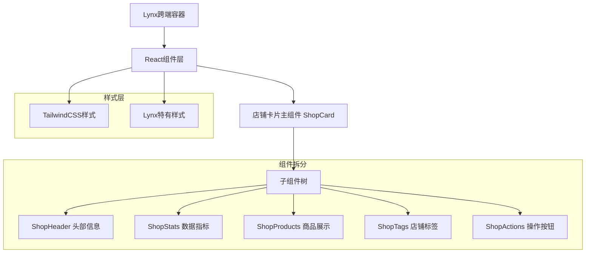

## 1. 架构设计



## 2. 技术栈描述
- **前端框架**: React@18 + Lynx跨端框架
- **样式方案**: TailwindCSS@3 + Lynx样式系统
- **构建工具**: Vite
- **初始化工具**: vite-init
- **后端服务**: 无（纯展示组件）

## 3. 组件拆分方案

### 3.1 主组件结构
| 组件名称 | 组件路径 | 功能描述 |
|---------|---------|----------|
| ShopCard | `/src/components/ShopCard/index.jsx` | 店铺卡片主组件，负责数据整合和布局 |

### 3.2 子组件拆分
| 组件名称 | 组件路径 | 父组件 | 功能描述 |
|---------|---------|--------|----------|
| ShopHeader | `/src/components/ShopCard/ShopHeader.jsx` | ShopCard | 店铺头像、名称、认证、评分 |
| ShopStats | `/src/components/ShopCard/ShopStats.jsx` | ShopCard | 粉丝、作品、获赞数据展示 |
| ShopProducts | `/src/components/ShopCard/ShopProducts.jsx` | ShopCard | 热门商品图片横向滚动 |
| ShopTags | `/src/components/ShopCard/ShopTags.jsx` | ShopCard | 店铺类型和特色标签 |
| ShopActions | `/src/components/ShopCard/ShopActions.jsx` | ShopCard | 关注和进入店铺按钮 |

### 3.3 工具组件
| 组件名称 | 组件路径 | 功能描述 |
|---------|---------|----------|
| StarRating | `/src/components/Common/StarRating.jsx` | 星级评分组件 |
| NumberFormat | `/src/components/Common/NumberFormat.jsx` | 数字格式化组件 |
| ImageLoader | `/src/components/Common/ImageLoader.jsx` | 图片加载组件 |

## 4. 组件接口定义

### 4.1 主组件 Props
```typescript
interface ShopCardProps {
  shopId: string;
  shopName: string;
  shopAvatar: string;
  isVerified: boolean;
  rating: number;
  followers: number;
  works: number;
  likes: number;
  products: Array<{
    id: string;
    image: string;
  }>;
  tags: string[];
  isFollowed: boolean;
  onFollow: (shopId: string) => void;
  onEnterShop: (shopId: string) => void;
}
```

### 4.2 子组件 Props
```typescript
// ShopHeader Props
interface ShopHeaderProps {
  shopName: string;
  shopAvatar: string;
  isVerified: boolean;
  rating: number;
}

// ShopStats Props
interface ShopStatsProps {
  followers: number;
  works: number;
  likes: number;
}

// ShopProducts Props
interface ShopProductsProps {
  products: Array<{
    id: string;
    image: string;
  }>;
}

// ShopTags Props
interface ShopTagsProps {
  tags: string[];
}

// ShopActions Props
interface ShopActionsProps {
  shopId: string;
  isFollowed: boolean;
  onFollow: (shopId: string) => void;
  onEnterShop: (shopId: string) => void;
}
```

## 5. 文件目录结构

```
src/
├── components/
│   ├── ShopCard/
│   │   ├── index.jsx                 # 主组件
│   │   ├── ShopHeader.jsx            # 头部信息组件
│   │   ├── ShopStats.jsx             # 数据指标组件
│   │   ├── ShopProducts.jsx          # 商品展示组件
│   │   ├── ShopTags.jsx              # 店铺标签组件
│   │   ├── ShopActions.jsx           # 操作按钮组件
│   │   └── styles.module.css         # 组件样式
│   └── Common/
│       ├── StarRating.jsx            # 星级评分
│       ├── NumberFormat.jsx          # 数字格式化
│       └── ImageLoader.jsx           # 图片加载
├── hooks/
│   ├── useShopData.js                # 店铺数据Hook
│   └── useFollow.js                  # 关注功能Hook
├── utils/
│   ├── numberFormat.js               # 数字格式化工具
│   └── imageLoader.js                # 图片加载工具
└── constants/
    └── shop.js                       # 店铺相关常量
```

## 6. Lynx特有适配

### 6.1 样式适配
- 使用Lynx的flex布局系统
- 适配移动端触摸事件
- 支持跨端样式一致性

### 6.2 性能优化
- 图片懒加载
- 组件懒渲染
- 事件节流处理

### 6.3 跨端兼容
- 处理不同平台的样式差异
- 适配不同屏幕尺寸
- 支持深色模式