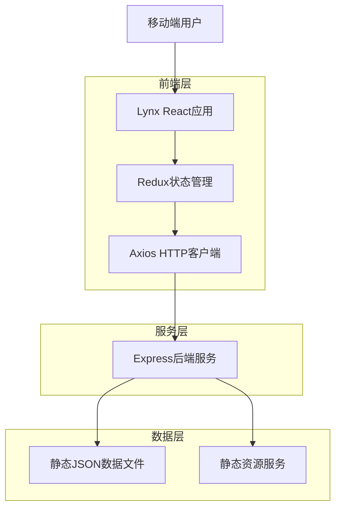
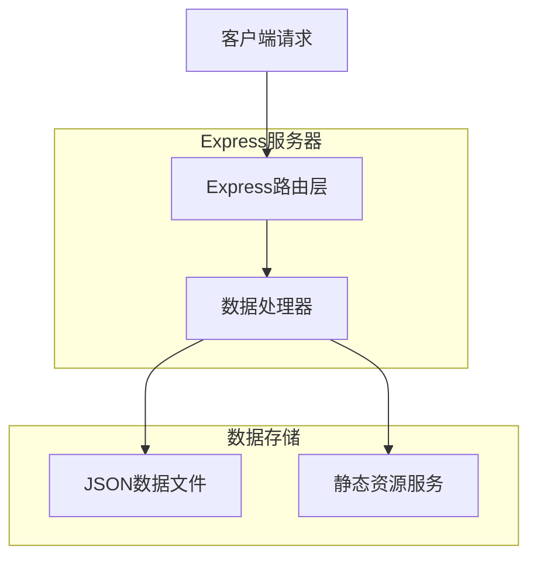
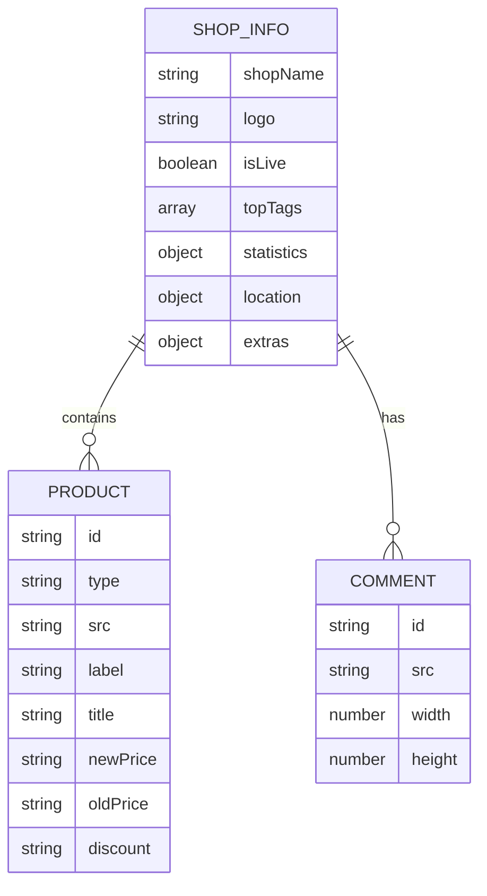

## 1. 架构设计



## 2. 技术描述

* **前端框架**: Lynx React + Redux Toolkit

* **构建工具**: Rspeedy (Lynx专用构建工具)

* **后端服务**: Express.js 5.x

* **HTTP客户端**: Axios

* **状态管理**: Redux Toolkit

* **开发语言**: JavaScript (ES6+)

* **移动端适配**: Lynx框架原生支持

## 3. 路由定义

| 路由                   | 用途                 |
| -------------------- | ------------------ |
| /                    | 店铺首页，展示店铺信息、商品和瀑布流 |
| /api/shop-header     | 获取店铺头部信息           |
| /api/shop-products   | 获取促销商品列表           |
| /api/waterfall-cards | 获取瀑布流评论图片          |
| /static/\*           | 静态资源服务             |
| /health              | 健康检查接口             |

## 4. API定义

### 4.1 店铺信息API

```
GET /api/shop-header
```

响应参数：

| 参数名        | 类型      | 描述                |
| ---------- | ------- | ----------------- |
| shopName   | string  | 店铺名称              |
| logo       | string  | 店铺Logo路径          |
| isLive     | boolean | 是否直播中             |
| topTags    | array   | 顶部标签列表            |
| statistics | object  | 统计数据（评分、评价数、人均价格） |
| location   | object  | 位置信息（分类、地址、距离）    |
| extras     | object  | 额外信息（排名、用户标签）     |

### 4.2 商品列表API

```
GET /api/shop-products
```

响应参数：

| 参数名      | 类型     | 描述          |
| -------- | ------ | ----------- |
| type     | string | 商品类型        |
| src      | string | 商品图片路径      |
| label    | string | 商品标签（到店/外卖） |
| title    | string | 商品标题        |
| newPrice | string | 现价          |
| oldPrice | string | 原价          |
| discount | string | 折扣信息        |

### 4.3 瀑布流评论API

```
GET /api/waterfall-cards
```

响应参数：

| 参数名    | 类型     | 描述     |
| ------ | ------ | ------ |
| src    | string | 评论图片路径 |
| width  | number | 图片宽度   |
| height | number | 图片高度   |

## 5. 服务器架构



## 6. 数据模型

### 6.1 数据模型定义



### 6.2 数据定义

店铺信息数据结构：

```javascript
{
  shopName: "瑞幸咖啡 (江安花园店)",
  topTags: ["团购", "可配送"],
  logo: "/static/target-header-logo.png",
  isLive: true,
  statistics: {
    score: "4.3",
    scoreLabel: "推荐",
    reviews: "94条评价",
    avgPrice: "人均 ¥12"
  },
  location: {
    category: "咖啡厅",
    address: "四川大学江安校区",
    distance: "792m"
  },
  extras: {
    ranking: "入围成都市咖啡厅人气榜",
    userTags: ["购买过", "咖啡好喝"]
  }
}
```

商品数据结构：

```javascript
{
  id: "0",
  type: "custom",
  src: "/static/PromotionProduct/newhead-1.jpg",
  label: "到店",
  title: "【爆款甄选】瑞门爆款12选1",
  newPrice: "11.66",
  oldPrice: "￥32",
  discount: "3.7折"
}
```

瀑布流评论数据结构：

```javascript
{
  id: "0",
  src: "/static/example-pictures/comment-cards/0.png",
  width: 315,
  height: 548
}
```

